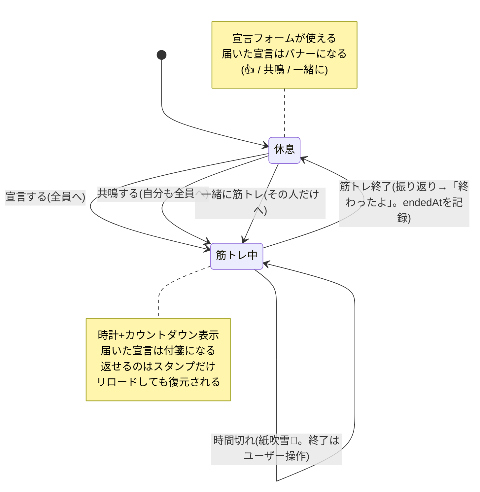
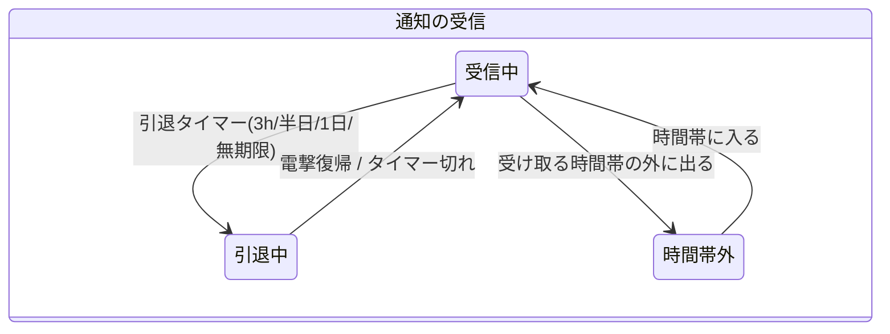
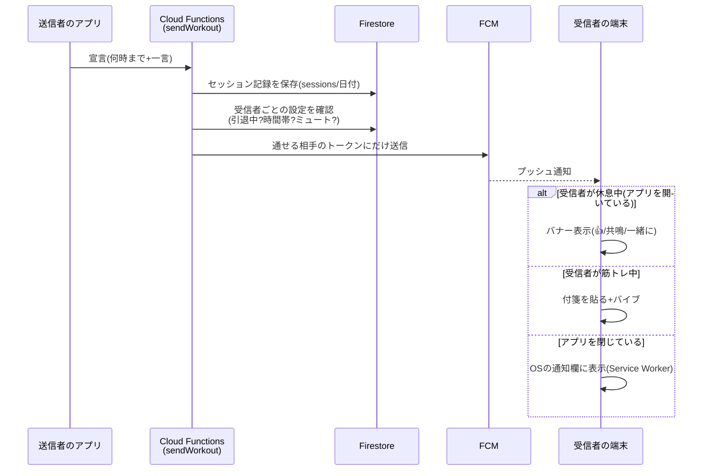

# イマキン 設計ドキュメント — 状態と画面の整理

このアプリの挙動は「**状態遷移図**」「**状態遷移表**」「**画面遷移図**」「**シーケンス図**」の4つで整理できます。
GitHub上でこのファイルを開くと図がそのまま表示されます。

---

## 1. 状態遷移図(ステートマシン)

アプリの心臓部。ユーザーは常に **休息状態** か **筋トレ状態** のどちらかにいる、と決めたことで挙動がシンプルになっています。



ポイント:
- **状態(state)** = アプリが「いまどういうモードか」。少ないほど良い(イマキンは2つ)
- **イベント(event)** = 状態を変えるきっかけ(宣言する、終了する、通知が届く…)
- **遷移(transition)** = 「この状態でこのイベントが起きたらこの状態へ」という矢印

### 直交する状態(応用)

「筋トレ/休息」とは**独立した軸**として「通知を受け取れるか」という状態もあります。
軸が独立している(=お互いに影響しない)と気づけると、組み合わせ爆発を防げます。



---

## 2. 状態遷移表(イベント × 状態の表)

図と同じ内容を**表**にしたもの。「この状態でこのイベントが起きたら?」を**全マス埋める**のがコツで、
考え漏れ(仕様の穴)を見つける道具として最強です。実装前にこの表を書くとバグが減ります。

| イベント \ 状態 | 休息 | 筋トレ中 |
|---|---|---|
| 宣言ボタンを押す | ✅ 送信して筋トレ中へ | ―(全画面時計で押せない) |
| 友達の宣言が届く | バナー表示(👍/🔗共鳴/🤝一緒に) | 付箋が貼られる+バイブ |
| 共鳴 / 一緒に筋トレ | ✅ 時刻を同期して筋トレ中へ | ―(付箋にスタンプのみ) |
| スタンプが届く | バナー表示(👍のみ) | ハンコ風に貼られる |
| 「終わったよ」が届く | バナー表示 | 付箋(筋トレ終了🎉)が貼られる |
| 筋トレ終了ボタン | ― | 振り返り(気分3択)→ 休息へ。sessionsに`endedAt`を書き、友達の「いま筋トレ中」からも消える |
| 終了時刻になる | ― | 紙吹雪+バイブ(状態は筋トレ中のまま) |
| リロード / アプリ再起動 | 休息のまま | 終了予定+60分以内なら筋トレ中を復元(時間切れ直後でも振り返りできる) |

「―」のマスは「起こらない/何もしない」。**空欄ではなく「―」と明示する**のが大事です(考えた上で無し、と分かる)。

---

## 3. 画面遷移図

どの画面からどの画面に行けるか。タブは行き来自由なので束ねて描き、特殊な遷移だけ矢印にします。

```mermaid
flowchart TD
    Login[ログイン画面] -->|Googleログイン| Tabs

    subgraph Tabs[下部ナビ(いつでも行き来できる)]
        Declare[💪 宣言]
        Everyone[🔥 みんな]
        History[🐤 記録]
        Notify[🔔 通知]
        Settings[⚙️ 設定]
    end

    Settings -->|友達の追加・管理| Friends[👥 友達ページ]
    Friends -->|← 戻る| Settings

    Declare -->|宣言 / 共鳴 / 一緒に| Workout[⏱ 筋トレ中画面(全画面)]
    Everyone -->|共鳴 / 一緒に| Declare
    Workout -->|筋トレ終了| Declare

    Banner{{受信バナー}} -.->|🔗 共鳴 / 🤝 一緒に| Declare
    PushNotif{{OSのプッシュ通知}} -.->|タップ| Declare
```

ポイント:
- **タブ(並列に行き来できる画面)** と **スタック(入って戻る画面: 友達ページ)** と **モーダル(覆いかぶさる画面: 筋トレ中)** を区別して描く
- 点線は「画面の外(通知など)から飛んでくる」入口。入口の整理は迷子防止に効きます

---

## 4. シーケンス図(登場人物のやりとり)

1つの機能を深掘りするとき用。「宣言が届くまで」を例に:



---

## 使い分けの目安

| 手法 | いつ使う |
|---|---|
| 状態遷移図 | アプリの「モード」を設計するとき。まずこれ |
| 状態遷移表 | 仕様の穴を潰すとき。「このマスどうする?」で会話できる |
| 画面遷移図 | タブやページを増やす/減らすとき |
| シーケンス図 | サーバーや通知が絡む1機能を深掘りするとき |

新機能を思いついたら「**どの状態のときの話か?**」「**遷移表のどのマスが変わるか?**」を先に考えると、
イマキンのシンプルさを保ったまま拡張できます。
